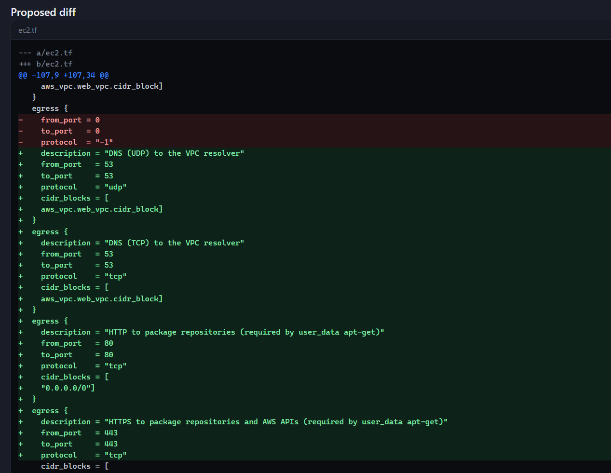
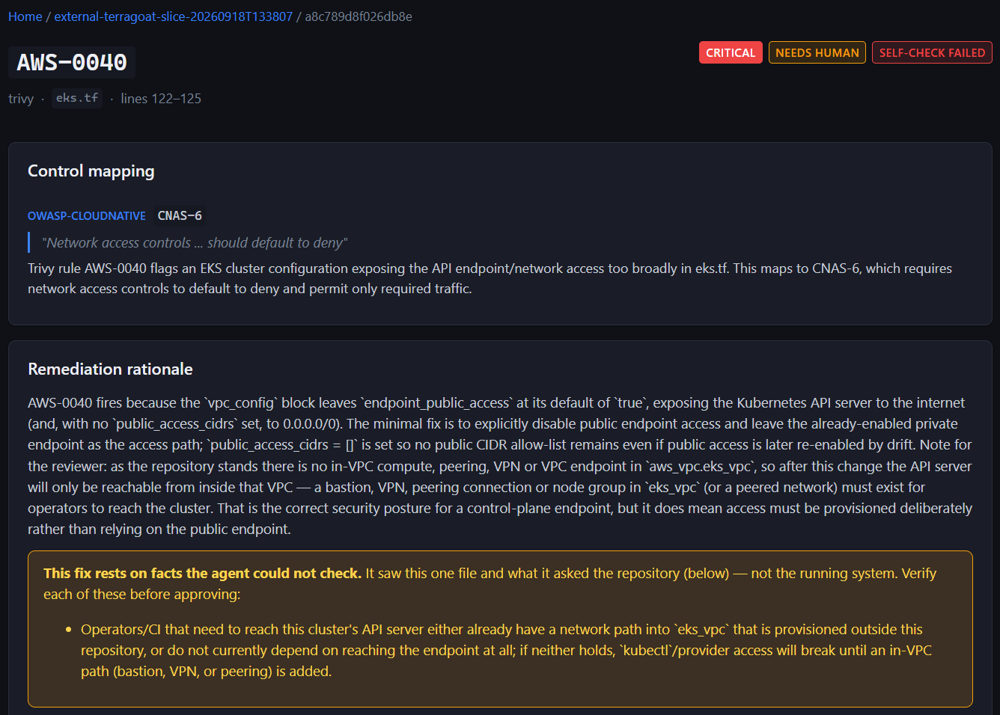
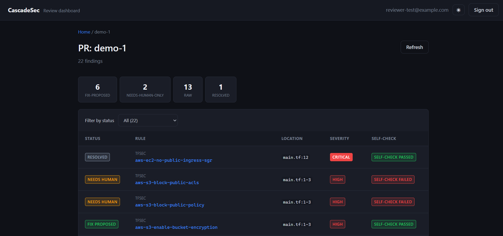

# CascadeSec

**Infrastructure-as-code security scanning with AI-drafted fixes that prove themselves before a human sees them. Runs on serverless AWS and inside the GitHub pull request.**


A deterministic scanner finds the misconfiguration. An LLM drafts the fix, then re-runs the same scanner against its own diff, and only a fix that passes reaches a reviewer. A maintainer can commit the verified fixes to the pull request's branch with one click on the GitHub check run.

**At a glance**

- **98.7% detection recall** (155 of 157) on a labelled corpus of 83 cases, measured against the deployed scanner — [method](./corpus/eval/README.md)
- **Six IaC languages:** Terraform, OpenTofu, Kubernetes, CloudFormation, Azure ARM and Bicep, mapped to OWASP and CIS controls
- **Deployed end to end:** pull request → check run → self-verified fixes → one-click commit, verified live on a test repository
- **14 AWS services, all in Terraform**, and 880 tests in CI (Lambda, corpus, dashboard), run with no AWS credentials



*A fix the agent proposed for a security group in [terragoat](https://github.com/bridgecrewio/terragoat), code nobody on this project wrote. The `0.0.0.0/0, all ports` egress is replaced by four scoped rules. The agent read the instance's `user_data` and found the `apt-get` that needs ports 80 and 443.*

## How it works

**The design principle: the agent proposes, it never decides.**

1. **Detect.** Trivy, Checkov, KICS and the project's own Rego checks find the issue. Detection is deterministic, so the model cannot hallucinate a finding.
2. **Map.** An LLM agent maps each finding to the control it violates, with a citation. It can only choose among candidates that a curated rule-to-control table allows.
3. **Fix and self-check.** A second agent drafts a minimal diff, then re-scans its own fix. A fix that doesn't clear the finding, introduces a new one, or suppresses the scanner instead of fixing anything is never shown to a human as a suggestion.
4. **Ask instead of assume.** When a fix depends on the rest of the repository, the agent asks a context agent, and every answer is cited to `file:line`.
5. **A human decides.** Every fix is reviewed and committed by a person, either in the dashboard or on GitHub. Nothing is auto-merged.

### Why

Most "AI security scanner" tools ask an LLM to find and judge issues in one pass, with no way to check the model's claims. CascadeSec keeps detection deterministic and checks every LLM-drafted fix against the same scanner that found the problem. A proposed fix is never just the model's word that it worked.

## In a pull request

1. A push to a PR triggers a scan through the **CascadeSec GitHub App**. The PR gets a check run with annotations on the lines it adds.
2. **Draft fixes** on the check runs remediation. Self-checked fixes inside the PR's diff are posted as suggested changes.
3. The check then shows every verified fix as a diff, with a **Commit fixes** button for anyone with write access. A second App, **CascadeSec Fixes**, commits them to the branch as one signed commit. It writes only over the file versions the fixes were drafted on, and refuses a click on an outdated check.
4. That commit is scanned like any other push, which verifies each fix on the real branch.

The same commit can be requested from the review dashboard by members of a `committers` Cognito group.

## Screenshots

A finding the agent would *not* propose a fix for. The self-check failed and the fix rested on something the agent could only assume about the repository, so it is held for a human with the assumption spelled out.



The review queue for one scan. Every finding carries its status, the rule that raised it, and whether the proposed fix survived the self-check.



## Architecture

```
GitHub PR / scripts/scan.py
        │
        ▼
webhook-receiver (Lambda) ──▶ Step Functions (one execution per PR push)
                                      │
                                      ▼
                         iac-scanner (Lambda, container image)
                         Trivy + Checkov + KICS + IACP-* checks
                                      │
                                      ▼
                             mapping-agent (Lambda)
                       finding → OWASP/CIS control + citation
                                      │
                                      ▼
                    Map state: remediation-agent, one per file
                  proposes diff → self-checks against iac-scanner
                    ↳ context-agent: repo questions, cited to file:line
                                      │
                                      ▼
                     DynamoDB ──▶ github-gateway (Lambda)
                                  check run, annotations, suggestions
                                      │
              Commit fixes click / dashboard request (committers group)
                                      │
                                      ▼
            commit state machine → github-committer (Lambda, writer App)
                         one signed commit on the PR branch

API Gateway (Cognito JWT) → review-api (Lambda) → dashboard (React + Vite + TS, CloudFront + S3)
```

Lambda, Step Functions, API Gateway, DynamoDB, S3, ECR, Cognito, CloudFront, Secrets Manager, KMS (the GitHub Apps' signing keys), EventBridge, CloudWatch (EMF metrics, alarms), X-Ray and SNS, all provisioned in Terraform. Built partly as hands-on practice for AWS Developer Associate (DVA-C02).

Full technical spec (data model, agent JSON contracts, eval plan, build phases): [`iacposture-spec.md`](./iacposture-spec.md). Per-feature specs are in [`docs/`](./docs/).

## Evaluation

Detection recall is measured, not assumed. The test set is a labelled corpus of Terraform, OpenTofu, Kubernetes, ARM and Bicep cases with known injected vulnerabilities, scanned by the **deployed** scanner.

**98.7%: 155 of 157 expected findings across 78 positive cases and 5 clean controls** (2026-09-23, Trivy 0.74.0 + Checkov 3.3.16 + KICS 2.1.20 + `IACP-0001`). By source: Trivy 57/57, KICS 13/13, Checkov 85/87. Both misses are documented upstream tool gaps and were left as misses, not relabelled. The full method, the corrections log, and what the number does *not* measure are in [`corpus/eval/README.md`](./corpus/eval/README.md).

## Running it

Against the deployed dev stack, with AWS credentials and `terraform` on `PATH`:

```bash
python scripts/scan.py path/to/terraform          # upload, scan, map, then ask before remediating
python scripts/scan.py path/to/terraform --yes    # don't ask
python corpus/eval/run_eval.py                    # detection recall over the labelled cases
python corpus/external/run_external.py           # scan pinned third-party repos, compare to baseline
```

`scan.py` uploads the directory, starts one execution of the pipeline, reports each stage as it runs, and prints the dashboard URL when it finishes. Remediation costs one model call per mapped finding, so `scan.py` asks before running it (`--no-remediate` stops after mapping).

## Status

**Deployed and running** against a dev AWS account, with a GitHub App installed on a test repository. CI runs the Lambda suites (pytest, 581 tests), the corpus data tests (209) and the dashboard's lint, type-check and tests (90) on every push. It runs deliberately without AWS credentials, so a test run can never touch real infrastructure.

| Version | What | State |
|---|---|---|
| v1 | Terraform scanning, control mapping, self-verified remediation, review dashboard | Deployed |
| v2 | Kubernetes manifests, CloudFormation, Azure ARM and Bicep (CIS Azure 3.0) | Deployed; Helm and CDK deliberately out of scope ([why](docs/multi-iac-spec.md)) |
| v3 | GitHub App: PR check runs, annotations, Draft fixes as suggested changes | Deployed 2026-09-25 ([spec](docs/ci-integration-spec.md)) |
| v4 | Write-back: verified fixes committed to the PR branch from the dashboard or a **Commit fixes** button on the check | Deployed and verified live 2026-09-30 ([write-back](docs/write-back-spec.md), [GitHub-first review](docs/github-first-review-spec.md)) |

## Tech stack

- **Infra:** AWS Lambda (zip and container image), Step Functions, API Gateway, DynamoDB, S3, ECR, Cognito, CloudFront, Secrets Manager, KMS, EventBridge, CloudWatch, X-Ray, SNS, all in Terraform
- **GitHub:** two GitHub Apps (a reader and a writer). They use webhooks, the Checks API (annotations and action buttons), PR reviews with suggested changes, and signed commits through the Git Data API
- **Scanning:** Trivy, Checkov, KICS, and custom Trivy checks in Rego
- **Agents:** Anthropic API, with outputs constrained to strict JSON schemas
- **Frontend:** React, Vite, TypeScript
- **CI:** GitHub Actions: pytest per Lambda, corpus data tests, and oxlint, `tsc` and Vitest for the dashboard

## Disclaimer

This is an educational/portfolio project built to explore agentic AppSec/DevSecOps tooling patterns. It has not been security-audited and is not intended for production use scanning or remediating real infrastructure without independent review.

## License

MIT
