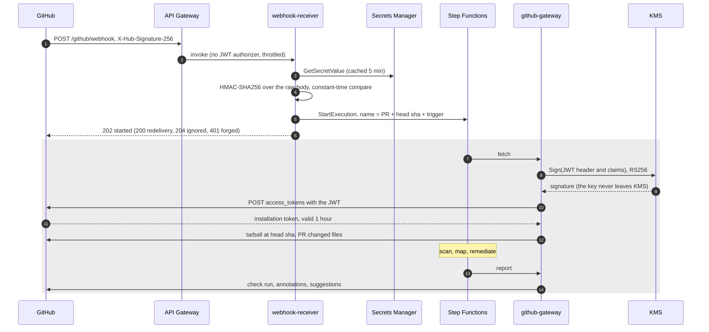

# CI integration (v3) — spec

A GitHub App that scans a pull request when it is opened or pushed to, and
reports back on the PR itself: a check run with annotations, and — when the
reviewer asks for them — fixes posted as suggested changes.

Written before building, 2026-09-23, and revised as it was built,
2026-09-24–25; where the build departed from the draft, the section says so
and why. §9 is the status. The GitHub API claims are from GitHub's
documentation and are marked **(verify)** until a deployed run has shown them.

## 1. What changed since the spec's v3 was written

`iacposture-spec.md` §4.4 describes v3 as `webhook-receiver` → S3 → **SQS** →
`iac-scanner`, with mapping on a DynamoDB stream. Three things have been built
since, and each one removes part of that design:

- **Step Functions owns orchestration** (§8.2 item 5). One Standard execution
  per PR runs scan → map → `Map` over files → remediate. Its input is
  `{pr_id, s3_prefix, remediate}`, the same thing `scripts/scan.py` sends. So
  v3 is not a new pipeline: it is a new way to **start** this execution and a
  new place to **report** what it found.
- **One scanner for every language** (multi-iac-spec §3). `webhook-receiver`
  no longer tags or routes by `iac_type`; it uploads a snapshot.
- **A re-scan preserves review state** (§8.2 item 3). Every push to a PR is a
  re-scan of the same `pr_id`, and that already keeps `status`,
  `proposed_fix` and the review history of a finding whose content did not
  change. v3 depends on this and adds nothing to it.

**SQS is dropped.** It was there so the webhook could return inside GitHub's
10-second window while a long scan ran. `StartExecution` returns in
milliseconds and a Standard execution is itself durable, so the queue would
add a hop and a consumer and remove no risk. The one thing a queue could
have done — serialise pushes to the same PR — it cannot do here, because its
consumer would return after starting an execution, not after the execution
finishes (§6.2). This drops a DVA-C02 rep that §4.1 listed; decided
2026-09-24 (D2). Cost played no part: at a few requests per push SQS sits
inside its permanent free tier either way.

## 2. Flow

Two directions of trust carry a PR through, and the first diagram is about
them. The **webhook secret** (symmetric, shared with GitHub) proves a
delivery came **from** GitHub; the **App key** (asymmetric, private half in
KMS) proves a call **to** GitHub comes from the App. The shaded part is built
and tested but not yet deployed.



What one execution does between `fetch` and `report`. Solid arrows are the
state machine's order; dotted ones are data. Dashed boxes are built but not yet deployed.


The same, as the state machine sees it:

```
PR opened / synchronize / reopened
  → API Gateway  POST /github/webhook      (no JWT authorizer; the HMAC is the auth)
  → webhook-receiver                       verify signature, filter, StartExecution
  → state machine
       fetch     (github-gateway)   in-progress check run; tarball at head_sha → scans/<pr_id>/;
                                    PR's changed files + patch hunks → S3
       scan      (iac-scanner)      unchanged
       map       (mapping-agent)    unchanged
       remediate (remediation-agent) only if remediate=true — unchanged
       report    (github-gateway)   complete the check run; post suggestions
     Catch on every state → report   (the check run must never stay in_progress)
```

`scripts/scan.py` keeps working unchanged: `fetch` and `report` run only when
the input carries a `github` object, chosen by a `Choice` state, so a manual
run is the existing execution with two states skipped.

### 2.1 Two Lambdas, split by the credential each one can use

| Lambda | Holds | Can do |
|---|---|---|
| `webhook-receiver` | webhook secret only | `states:StartExecution` on the one state machine |
| `github-gateway` | `kms:Sign` on the App key — never the key itself | `s3:PutObject`/`DeleteObject` on `scans/*`, read of the finding table, GitHub API as the installation |

The receiver is the only internet-facing code that parses untrusted input
before authentication, so it gets nothing worth stealing: a forged request
that got past it could start an execution, and nothing else. The private key,
which can act on every repository the App is installed on, is not held by
any function: it lives in KMS, and the one role allowed to sign with it
belongs to a function API Gateway cannot reach (§4.1). Same least-privilege argument as
§4.1's per-Lambda roles, which is the point of the project.

`github-gateway` has two entry points (`fetch`, `report`) rather than being
two Lambdas, because both need the same signing grant and the same
installation-token code; splitting them would double the roles that can act
as the App and gain nothing.

## 3. `webhook-receiver`

1. Verify `X-Hub-Signature-256` — HMAC-SHA256 of the **raw** body, compared
   with `hmac.compare_digest`. The HTTP API delivers the body as a string,
   base64-encoded when `isBase64Encoded` is set; decode first, and never
   re-serialise parsed JSON to check it. Reject with 401 before parsing.
2. Accept `pull_request` with action `opened`, `synchronize`, `reopened`,
   `ready_for_review`, and `check_run` with action `requested_action` (the
   Draft fixes button, §5) or `rerequested` (GitHub's Re-run). Anything else:
   204. A `check_run` counts only if it is **ours** — named `CascadeSec`, and
   for `requested_action` carrying the `draft_fixes` identifier — because an
   App subscribed to `check_run` receives every check run on the repository:
   about 25 per push on PugetScope, from its own CI. A `check_run` with an
   empty `pull_requests` (GitHub's shape for a PR from a fork) is ignored;
   the push that opened the PR already ran.
3. Skip draft PRs until `ready_for_review` (decision D4).
4. `StartExecution` with a **deterministic name** built from `pr_id`, the head
   SHA and the trigger: `push`, `fixes`, or `rerun-<delivery>`. GitHub
   redelivers with the same payload; `ExecutionAlreadyExists` makes that
   idempotent for free, so a redelivery returns 200 and starts nothing. A
   second click on Draft fixes for the same commit is the same name, and
   starts nothing either; each Re-run click is its own delivery, and so its
   own name. The alphabet and length limit match `scan.py`'s
   `execution_name`, whose names carry a timestamp and cannot collide with
   these. *Not shared code, as the draft proposed:* the two build different
   strings, so the agreement worth testing is the Step Functions rule, which
   the receiver's tests assert.
5. Return 202. Nothing in this function waits on GitHub or S3.

`pr_id` is `gh-<repository id>-<number>`. It must be stable across pushes
(state preservation keys on it) and distinct across repositories. *Changed
2026-09-24 from `gh-<owner>-<repo>-<number>`:* owner and repo names can both
contain hyphens, so `a-b/c` and `a/b-c` joined to the same string, and a
renamed repository would have orphaned its PRs' review history. The numeric
id is unique and never changes; the readable `owner/repo` travels in the
execution input. The installation id is kept out of `pr_id` for the same
reason: reinstalling the App changes it.

## 4. `github-gateway`

### 4.1 Authentication

JWT signed RS256 with the App's private key (`iss` = App id, `exp` ≤ 10
minutes) → `POST /app/installations/{id}/access_tokens` → a token valid for
an hour, scoped to the installation. Mint one per invocation; an execution is
shorter than an hour but a cached token is one more thing to expire at the
wrong moment.

**The private key is in KMS, not Secrets Manager** (decided 2026-09-24). The
JWT's header and claims are built with the standard library and the RS256
signature is `kms:Sign` with `RSASSA_PKCS1_V1_5_SHA_256`, so no function can
read the key, only use it, and every use is a CloudTrail event. A key in
Secrets Manager is readable by any role granted `GetSecretValue`, and readable
for good once copied out. It is imported rather than generated because GitHub
generates App keys and accepts no uploaded public key; so the guarantee holds
from the import onward, once the downloaded `.pem` and the interim Secrets
Manager copy are deleted. `scripts/import_github_app_key.py` creates the key
(`Origin=EXTERNAL`, alias `alias/iacposture-dev-github-app`), wraps and
imports the material locally, and proves it by verifying a KMS signature
against the local public key. Terraform looks the key up by alias: provider
5.x cannot create a key with imported material, and the material should not
pass through state anyway.

The webhook secret stays in Secrets Manager for now. It is symmetric, and
GitHub holds a readable copy regardless, so moving it gains less than moving
the App key did. A KMS HMAC key with imported material could still verify
deliveries without the receiver reading it (`VerifyMac`); whether KMS accepts
that import has not been checked. It has no placeholder value (`secrets.tf`
says why).

App permissions: Metadata read, Contents **read**, Pull requests write,
Checks write. Events: `pull_request`, `check_run`. Contents stays read-only
in v3; write is v4's scope and is requested when v4 needs it.

### 4.2 `fetch`

1. Create the check run on `head_sha`, status `in_progress`, and put its id in
   the execution state for `report`.
2. `GET /repos/{o}/{r}/tarball/{head_sha}` (a redirect to codeload). Stream it
   through `tarfile` in memory, and for each member:
   - skip anything that is not a regular file (symlinks, hardlinks, devices);
   - strip the top-level `<owner>-<repo>-<sha>/` directory, reject absolute
     paths and any `..` component — a key built from a tar path is a path
     traversal unless it is checked;
   - keep it if `is_snapshot_file` says the scanner would open it (a third
     copy of that rule, under the same agreement test).
3. Replace `scans/<pr_id>/` with the kept set (the same delete-then-put as
   `scan.py`'s `upload`, so a file deleted in the PR stops being scanned).
4. `GET /pulls/{n}/files` (paginated) and store each file's status and
   `patch` to `github/<pr_id>/<head_sha>/files.json`. `report` needs the
   hunks to know which lines a comment may attach to (§4.3).

5. Return the IaC files among the PR's changed files, `changed_files`. It
   rides in the execution state, so it scopes mapping (§6.1) and Draft fixes
   (§5) without another call.

**Limits.** 200MB of tarball read, 3,000 kept files, 50MB of kept content,
1,000 changed IaC files (the last because `changed_files` rides in the
256KB execution state). Generous on purpose: PugetScope's whole tarball is
about 2MB. Over any of them the check completes as `neutral`, "too large to
scan", and **no partial scan runs**: a partial scan looks exactly like a
clean one for the files it skipped, which is the failure mode this project
exists to prevent. A commit with no IaC at all completes the same way,
"nothing to scan", instead of failing the scanner.

**The redirect.** The tarball endpoint answers with a redirect to codeload
whose URL carries its own short-lived authorisation. urllib would follow it
with the installation token still attached, so the redirect is refused and
followed bare.

The whole repository is snapshotted, not only the changed files. The scanner
resolves modules and variables across files, and `context-agent` answers a
fix's questions by reading the rest of the repo; a changed-files-only snapshot
would change what both of them see and make a PR's results disagree with a
manual scan of the same commit.

### 4.3 `report`

Reads the PR's findings from DynamoDB and the stored hunks, then:

- **Check run.** Completes with a summary: counts by severity and by
  `target_type`, the scan errors, and the dashboard link `/prs/<pr_id>`.
  **Annotations** only for findings whose `line_range` intersects a line the
  PR **added**. Annotations are sent at most 50 per API call **(verify)**,
  batched across updates.
- **What "introduced by this PR" means.** Without a scan of the base commit
  the project cannot know which findings are new. Intersecting with added
  lines is the cheap approximation, and it is stated as one in the summary:
  it misses a finding that a change *enables* on an untouched line (a
  variable default that flips a resource elsewhere), and the summary still
  counts every finding in the repo. A base-commit scan is deferred (§7).
- **Suggestions**, on a Draft fixes run (§5). One PR review, event
  `COMMENT`, commit `head_sha`. *Revised from the draft, which had one
  comment per fix:* fixes are chained (`applies_after`), each drafted on the
  file as the previous verified fix left it, so one fix's diff is in the line
  numbers of an intermediate file nobody has, and only the chain's **last**
  corrected file (`fixes/<pr_id>/<tip>/<file>`) was self-checked with every
  earlier fix in it. So, per file:
  1. the **tip** is the `fix-proposed`, self-check-passed fix whose chain
     covers every other such fix on the file, with each link's recorded
     `diff_sha256` still matching — an edited link means no tip;
  2. the chain's root diff must apply to the current snapshot, or the fix was
     drafted on an earlier commit and is held ("run Draft fixes again");
  3. the tip's corrected file is diffed against the PR head, and each hunk
     becomes one ```` ```suggestion ```` comment on its `start_line`..`line`
     (a pure insertion is anchored to the line before it);
  4. **all of a file's hunks or none**: if any hunk touches a line outside the
     PR's right-side diff, GitHub cannot take it as a suggestion, and a
     subset of the hunks was never verified — so the whole file is held and
     the summary says why, with the dashboard link.

  `needs-human-only` findings and failed self-checks are never posted, and
  neither is any model prose: the comment body is the rule ids, the file and
  the suggestion. If GitHub still rejects the review (422), the files are
  reported as held rather than the execution failing.
- **Idempotency.** A retried `report` must not post the review twice.
  Before posting, the PR's reviews are listed and the post is skipped if one
  carries this execution's marker (`<!-- cascadesec:<execution name> -->`).
- **Draft fixes remediates the changed files only.** A fixes run follows the
  push that mapped everything, so its own mapping pass maps nothing and
  mapping-agent's `files` is empty. `select_files` (a gateway action before
  the Remediate Map) lists the changed files still holding a `mapped`
  finding, and those are what is remediated — not every mapped finding in
  the repository, which on PugetScope would be hundreds of model calls for
  a handful of postable suggestions.

**Conclusion** is `neutral` in v3 regardless of findings (decision D1). The
check is advisory until §7's fix-acceptance rate exists to say its
suggestions deserve to block a merge.

## 5. Remediation is a button, not a push

`scan.py` asks before remediating because it is the stage that costs model
calls, one or more per finding. A webhook cannot ask, and running it on every
push of every PR spends the most exactly where it is least wanted: on
work-in-progress commits that the next push replaces.

So a push runs scan and map only (`remediate: false`), and the completed
check run carries an action button, **Draft fixes**. Clicking it sends
`check_run.requested_action`; the receiver starts the same execution with
`remediate: true` on the same head SHA. The re-scan costs about a minute and
changes nothing, because review state is preserved.

This also gates cost on who can click: action buttons are shown only to users
with write access to the repository **(verify)**. That matters for §6.1 — an
outside contributor's PR is scanned and mapped, but no model call drafts a
fix for it until a maintainer asks.

## 6. Risks

### 6.1 Untrusted PRs

A PR from a fork is attacker-controlled input. What that allows:

- **Code execution:** none. Nothing is executed — the scanners parse files,
  which is why Pulumi and CDK are out (multi-iac-spec §7). That rule is what
  lets v3 accept fork PRs at all, and it should be restated wherever someone
  proposes adding a language that needs running.
- **Prompt injection into the agents.** File contents reach `mapping-agent`,
  `remediation-agent` and `context-agent`. The defences are the ones already
  there: strict JSON-schema outputs, the suppression and deletion gates, and
  the self-check that re-scans every fix. v3 adds one exposure — output now
  reaches a public PR thread — and one limit: `report` posts only fields
  code produced (diffs that passed self-check, rule ids, counts). It never
  posts free text from a model: not `explanation`, not `assumptions`.
- **Cost.** Remediation waits for a maintainer (§5). Mapping is one model call
  per finding, so it is **scoped to the PR's changed IaC files**
  (mapping-agent's `only_files`, from `fetch`'s `changed_files`): the rest of
  the repository is scanned and counted, but a finding in a file the PR did
  not touch costs nothing and stays `raw`. *This replaces the draft's "cap
  mapped findings per execution":* a cap bounds the cost of a hostile PR but
  still spends it on files nobody changed; the scope spends nothing there,
  and a PR's cost now follows what it changed. A PR that changes one huge
  file can still run one up — bounded by `fetch`'s limits, not by a count.

### 6.2 Two pushes, one PR

Two quick pushes start two executions on the same `pr_id`. They share
`scans/<pr_id>/`, so the second `fetch` can replace the snapshot while the
first scan is reading it, and both write the same findings.

Proposed: the receiver records the running execution ARN on the PR item
(conditional write) and calls `StopExecution` on the previous one before
starting the next. That stops the state machine, **not** a Lambda that is
already running; a remediation invocation completes and writes anyway. The
window is small while remediation is off by default, and the check run is
attached to the older SHA, so a stale report lands on a stale commit, which is
harmless.

The full fix is a snapshot prefix per SHA (`scans/<pr_id>/<sha>/`). It is not
free: `remediation-agent` (`handler.py:742`, `:758`) and `review-api`
(`handler.py:391`) build `scans/{pr_id}/` themselves rather than reading
`s3_prefix`. Deferred until the race is observed, and noted here so the
hard-coded prefix is not copied into a new place in the meantime. *Neither
fix is built:* the StopExecution proposal would give the receiver — the
internet-facing function — DynamoDB writes and StopExecution, which is a
larger grant than the race has earned yet.

### 6.3 A check stuck `in_progress`

*Revised from the draft, which had a `Catch` on every state routing to
`report`, with EventBridge as a backstop for `report` itself failing.* Built
as the backstop alone: an EventBridge rule on execution `FAILED`,
`TIMED_OUT` or `ABORTED` for this state machine invokes the gateway, which
finds the check run whose `external_id` is the execution's name and
completes it as `neutral`, "Scan did not finish". If `fetch` failed before
creating one, it creates a completed one, so the failure is still on the PR.
One mechanism covers every way an execution can end badly — a `Catch`
cannot cover the state it routes to, nor a timeout or a manual stop — and
the execution still ends `FAILED`, so the pipeline-failure alarm still
fires. The event carries the execution's input, which holds everything the
gateway needs; it does not carry the state, which is why the check run is
found by name rather than by id.

## 7. Not in v3

- **Write-back** of approved fixes to the branch — v4. Contents stays read.
- **A base-commit scan** to tell introduced findings from existing ones.
  It doubles scan cost per push; the added-lines approximation comes first,
  and its misses are what would justify this.
- **GitHub Enterprise Server and GitLab.**
- **Blocking merges.** See D1.

## 8. Decisions

| # | Decision | Outcome |
|---|---|---|
| D1 | Check conclusion when findings exist | `neutral` always in v3 — built |
| D2 | Drop SQS (§1) — loses a DVA-C02 rep | Decided 2026-09-24: dropped |
| D3 | Remediation on push, or behind the button (§5) | Button — built |
| D4 | Scan draft PRs | No; start at `ready_for_review` — built |
| D5 | Which repos the App is installed on | **Open.** All of the account's repositories as of 2026-09-25; §6.1's scoping is in, so the remaining reason to narrow it is noise, not cost |
| D6 | Ownership | Decided 2026-09-24: Konrad owns all of v3 |
| D7 | Where the App key lives (§4.1) | Decided 2026-09-24: KMS, imported |

## 9. Build order and status

1. **Register the App by hand** — done 2026-09-24. Still **(verify)**, to be
   settled by the first deployed Draft fixes run: whether a review with one
   out-of-diff suggestion fails whole (the code assumes it does, and holds
   such files back rather than find out), and who sees action buttons.
2. **Secrets, `webhook-receiver`, the API route** — built and deployed
   2026-09-24. Verified on PugetScope PR #9 and on this repository's own PR:
   a real push was delivered, verified, and started its execution.
3. **`fetch`**, with tests on hostile tarballs (symlink, hardlink, `..`,
   absolute path, backslash, oversize) — built 2026-09-25.
4. **`report`**: check run, summary and annotations — built 2026-09-25.
5. **The Draft fixes button and suggestions** — built 2026-09-25, with
   `select_files` and mapping's `only_files`.
6. **The stuck-check backstop** — built 2026-09-25 (§6.3).
7. **Metrics** — built 2026-09-25: `AnnotationsPosted`, `SuggestionsPosted`,
   `FilesHeldFromSuggestions` and `ExecutionsReportedFailed`, as EMF from the
   gateway. The ratio of held to posted files says whether the added-lines
   rule is costing more fixes than it should.

Steps 3–7 are unit-tested and not yet deployed: they need the App key in
KMS (`scripts/import_github_app_key.py`) before the first apply.
