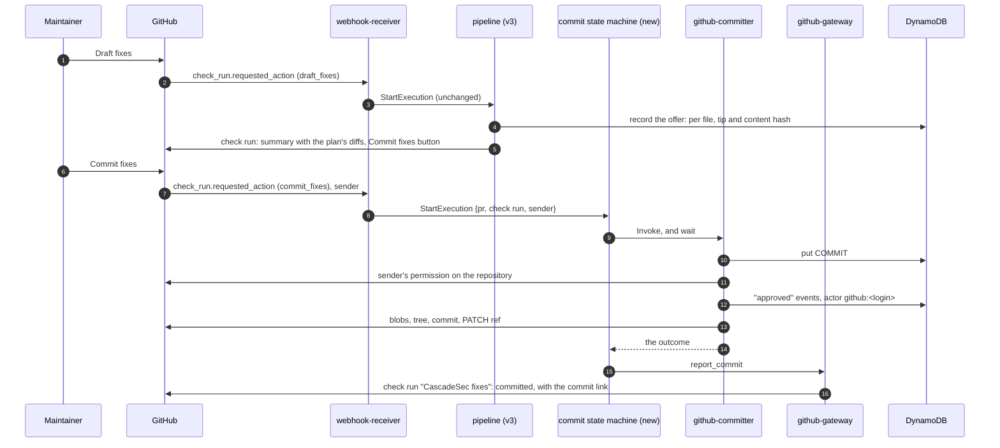

# GitHub-first review — spec

A proposal to let a maintainer take CascadeSec's verified fixes from the
pull request to the branch without leaving GitHub. It amends write-back
(v4, [`write-back-spec.md`](./write-back-spec.md)), whose decision W3 put
every commit behind the dashboard, and adds nothing the dashboard loses.

Written 2026-09-30, before building. **Built the same day, steps 1-5 and
7 of §9, and not yet deployed**; §10 records where the build departed from
this plan, and the text below describes what was built. GitHub API claims
are from GitHub's documentation and are marked **(verify)** until a
deployed run has shown them. §9 is the build order and §8 the decisions.

## 1. The problem

A maintainer works in the pull request. Today a fix reaches the branch one
of two ways:

- **In GitHub**, a verified fix inside the PR's diff is posted as a
  suggestion, and **Commit suggestions** applies it (v3).
- **In the dashboard**, anything else: a fix outside the diff (GitHub cannot
  take it as a suggestion), a chain of fixes on one file whose hunks reach
  outside the diff, a held fix, an edit. A committer approves there, reviews
  the commit plan, and commits (v4).

So a PR whose fixes are all verified still sends its maintainer to a second
tool when any one of them sits outside the diff. On cascadesec-testbed #2
that was most of them. And the dashboard asks for a second login, Cognito,
for a decision the PR's own permissions could settle.

## 2. What stays in the dashboard, and why

Not everything can move, and the line is not arbitrary:

- **Held fixes.** A fix is held because a gate fired: it deletes a
  resource, rests on an assumption, or asked the repository something it
  could not answer. Weighing it means reading the model's rationale and
  assumptions. ci-integration-spec §4.3 posts no model prose to GitHub --
  a PR's comments are public on a public repository, and model prose there
  reads as a claim CascadeSec makes -- and that rule stands. So a held fix
  is reviewed where its reasons are shown.
- **Edits.** A reviewer edits a whole corrected file. A PR comment thread
  is the wrong surface for that.
- **Rejections, and the audit trail.** Both stay where the whole review
  history is readable.

What moves is the case that needs no judgement beyond "yes": **fixes that
passed their self-check**, whatever their position in the file.

## 3. The design: a Commit fixes button

After a Draft fixes run, the CascadeSec check run carries a second button,
**Commit fixes**, beside the summary of what it would commit. One click by
a maintainer with write access approves the listed fixes and commits them,
as one commit, through write-back's github-committer. Nothing else about
write-back changes: the same writer App, the same base check against the
branch, the same compare-and-swap ref update, the same records.



### 3.1 What the button commits: the offer

The summary a maintainer reads is the thing they approve, so the click
commits exactly what the summary showed and nothing else -- the rule the
dashboard's `confirm` list enforces (write-back-spec §14).

When `report` finishes a Draft fixes run, it computes the **offer**: per
file, the longest chain made only of verified fixes -- `chain_tip`, which
already picks what v3 posts -- with the tip's content hash and the diff
from the PR head to the tip. The summary shows each file's diff, in and
out of the PR's diff alike, since a summary is not bound to diff lines the
way a suggestion is. The offer is stored under the check run's id, and the
button is added only if the offer has a file in it.

Check run summaries cap at 65,535 characters **(verify)**. An offer whose
diffs do not fit lists the files and links to the dashboard for the rest,
and the button is still offered: the stored offer, not the rendered text,
is what the click commits. The truncation says so in the summary.

### 3.2 Who may click it

Anyone with **write access or above** to the repository: the write,
maintain and admin roles. Triage and read are not enough, and there is no
further list (G2, decided 2026-09-30). Not the Cognito group `committers`,
which remains the rule for dashboard commits.

The committer checks it at the time of the click with
`GET /repos/{owner}/{repo}/collaborators/{username}/permission` under the
writer App's token, and accepts a `permission` of `admin` or `write`
**(verify)**. That field is GitHub's coarse one, which reports maintain as
`write` and triage as `read` **(verify)**; `role_name` carries the fine
role and a custom role, and is logged but not decided on, so a custom role
counts by the base permission GitHub folds it into.

GitHub shows a check run's action buttons to users with write access
**(verify)**, so the check is a second gate, not the only one. It is not
skipped for that: the webhook's `sender` is who clicked, and permission is
what the committer, not GitHub's UI, is accountable for. Anything below
write, or a user GitHub no longer knows, ends the request as `held` with
the reason, and the check run says so.

This is weaker than the dashboard's gate in one way, on purpose: anyone who
can push to the branch can commit CascadeSec's verified fixes to it. They
could push the same change by hand, so the button grants nothing new. A
repository that wants a narrower rule can leave the writer App uninstalled,
which is write-back's opt-in already.

### 3.3 Identity in the audit log

A click writes, per fix in the offer, a ReviewEvent with action `approved`
and actor `github:<login>`, with the numeric GitHub user id alongside:
logins can be renamed and reused, ids cannot. Then the committer's
`committed` event, as today. The dashboard's audit trail shows both kinds
of actor, labelled.

This is what W3 declined: "a GitHub-side button would put a second identity
system in the audit log." It does. The log stays one log -- every decision
is still an event on the finding, attributed to a verified identity -- but
a reader has to know an actor can now be a Cognito email or a GitHub user.
What makes a GitHub identity trustworthy here is the webhook's HMAC
signature, which webhook-receiver already verifies: the sender is GitHub's
statement, not the request's.

### 3.4 Getting the click to the committer

webhook-receiver holds only the webhook secret and `states:StartExecution`
on one state machine, by design (ci-integration-spec §2.1). It stays that
way in kind: it gains StartExecution on a **second, small state machine**,
not a Lambda invoke and not a table write.

That state machine invokes github-committer and waits for its answer.
Its execution name is (PR, check run, `commit`), so a redelivered webhook
or a double click starts nothing, as Draft fixes' name already does.

The committer records the COMMIT# request itself -- `source: github`, the
sender's login and id, the check run id, and the stored offer as the
confirmed set. Its id is a ULID whose time is the click's and whose
randomness is a hash of the PR, check run and clicker, so a retried
invocation finds the same request rather than making a second, and it
still sorts by time among the dashboard's requests.

The committer then works as write-back-spec §6 describes, with three
differences: it checks the clicker's permission first (§3.2); the
confirmed set is the stored offer rather than a list the dashboard sent,
and only the offered files are planned; and approval is the click, so it
writes the `approved` events itself, before any GitHub write, and only for
a file whose chain and content are still what the check run showed.

If the committer raises past the state machine's retries, a Catch asks it
to mark the request failed -- found by the same derivation -- and the
outcome is reported anyway.

### 3.5 Stale offers

An offer describes the PR head it was drafted on. A push after it makes it
stale, and the committer's base check holds every file whose head changed
-- that already exists. On top of it, the button is only honoured on the
check run for the PR's current head: a click on an older check run's
button ends the request as `held`, "this offer is for an older commit;
use the latest check". GitHub keeps older check runs' buttons clickable
**(verify)**, which is why this is checked rather than assumed.

### 3.6 Reporting the result

github-gateway posts a small check run of its own, "CascadeSec fixes",
on the new commit, linking it, or on the offer's commit for a held or
failed request, with each file's outcome and reason. The committer cannot:
the writer App holds Contents write and no Checks permission, and keeps
it that way, so the state machine carries the committer's answer to the
gateway's `report_commit`. The name differs from `CascadeSec` so
webhook-receiver never takes it for a check with buttons. The new head's
push also starts the ordinary scan, whose check run is the verification
(write-back-spec §7). The dashboard shows the request like any other,
marked as a click on GitHub.

## 4. Suggestions, once there is a button

v3's suggestions remain. They let a maintainer take one file's fixes and
not another's, which the button's all-or-nothing offer does not, and they
cost nothing to keep. What changes is the summary text: it says the
suggestions cover the files GitHub can show inline, and the button covers
every verified file.

## 5. Data model

```
CommitRequest (write-back-spec §10) gains, for a click:
├── source: github
├── requested_by            # "github:<login>" (a dashboard request's is an email)
├── github_user_id
├── check_run_id            # the offer accepted
├── offer_head_sha          # the commit the offer was drafted on
└── confirmed: [{ file, tip, chain, content_sha256 }]   # the offer's files

Offer (new, same table; written by the pipeline's RecordOffer after Report)
├── pk: PR#<pr_id>
├── sk: OFFER#<check_run_id>
├── head_sha, created_at
└── offer_json              # {check_run_id, head_sha, files: [{ file, tip, chain, content_sha256 }]}

ReviewEvent.actor           # may be "github:<login>"; github_user_id alongside
```

The offer is written by the state machine from `report`'s result, as
PullRequestMeta is (write-back-spec §12 step 2): github-gateway parses
tarballs and has no table write, and this spec does not give it one. The
result carries tips and hashes, not content, so it fits the 256KB state
limit. It is stored as one JSON string, since a nested list is awkward to
build as typed attributes in a service integration and nothing queries
inside it.

## 6. Security

- **Forks** stay refused. GitHub sends a fork PR's check_run event with an
  empty `pull_requests` list, and webhook-receiver already drops it.
- **A forged click** needs the webhook secret, the same bar as a forged
  Draft fixes click today.
- **Least privilege holds.** webhook-receiver gains one StartExecution
  grant; the commit state machine gains PutItem on `PR#gh-*` and invoke on
  the committer; the committer gains nothing but a GitHub API read. Nothing
  that parses a tarball can reach the writer key.
- **Nothing a model wrote is posted.** The summary's diffs are fixes that
  passed their self-check, which v3 already posts as suggestions; the
  rationale, assumptions and questions stay in the dashboard.

## 7. Not in this spec

- **Approving or rejecting a single finding from GitHub**, by comment
  command or reaction. It would need a per-finding surface on the PR, and a
  rejection's reason is exactly the prose §2 keeps off GitHub. The button
  is all the verified fixes in the offer, or none.
- **Held fixes on GitHub.** §2.
- **Committing on Draft fixes, without a click.** A maintainer still asks,
  as W3 wanted: one click instead of a trip to another tool.
- **Other platforms.** GitLab's equivalent is integrations-spec's.

## 8. Decisions

| # | Decision | Outcome |
|---|---|---|
| G1 | The button commits verified fixes only; held fixes and edits stay in the dashboard (§2) | Proposed |
| G2 | Authorisation for a GitHub click is write permission on the repository, checked by the committer (§3.2) | Decided 2026-09-30: write access or above (write, maintain, admin), and no further list |
| G3 | The audit log accepts GitHub identities, `github:<login>` with the user id (§3.3) | Decided 2026-09-30, with G2: a clicker with write access may have no dashboard account. Reverses W3's identity reasoning |
| G4 | The click commits the stored offer, not what is planned at click time (§3.1) | Proposed |
| G5 | A second state machine carries the click; webhook-receiver gets no invoke or table grant (§3.4) | Proposed |
| G6 | Suggestions stay (§4) | Proposed |
| G7 | A click on a check run for an older head is held (§3.5) | Proposed |

## 9. Build order

Each step is a commit of its own.

1. **The offer.** `report` computes it after a Draft fixes run and returns
   it; a state after Report stores it. The summary shows each offered
   file's diff. No button yet: this alone shows maintainers the
   out-of-diff fixes on GitHub, which today live only in the dashboard.
2. **The commit state machine**, and webhook-receiver starting it for a
   `commit_fixes` click, named for idempotency.
3. **The committer's GitHub path**: the permission check, the offer as the
   confirmed set, `approved` events under a GitHub actor, the current-head
   rule, and the result check run. The dashboard path is unchanged.
4. **The button** on the check run when the offer has a file, and the
   summary text of §4.
5. **The dashboard** labels GitHub actors in the audit trail and shows a
   request's source.
6. **Verify on cascadesec-testbed**: a click by the owner; by a
   collaborator with maintain (commits) and with triage or read (held); a
   click on an older check run (held); a double click (one commit); an
   offer with an out-of-diff file; a push between the offer and the click
   (base check holds the file). And each **(verify)** above.
7. **Docs**: write-back-spec W3 gains a pointer here, and ci-integration-
   spec §4.3 describes the offer.

## 10. As built (2026-09-30)

Where the build departed from the plan above, which has been edited to
match:

- **The committer records the request, and a gateway reports the
  outcome.** The plan had the commit state machine put the request and
  invoke the committer asynchronously, and the committer post a check run.
  The writer App cannot post one -- it holds Contents write and nothing
  else, deliberately -- so the machine waits for the committer's answer
  and hands it to github-gateway's `report_commit`, which already holds
  Checks write. The committer, not the machine, then records the request,
  under an id derived from the click (§3.4), and the machine's role needs
  no table access at all. A Catch marks the request failed if the
  committer raises past its retries, and the outcome is still reported.
- **Approvals only for a file still as offered.** The committer checks
  each offered file's chain -- verified, uncommitted, still reported --
  and the tip's content hash before approving it, since a redraft keeps
  the finding id and changes the content. A file that changed is held
  without an approval being written for it.
- **The permission check compares the account id,** not only the login,
  so a login renamed and taken by someone else between the click and the
  check cannot pass.
- **Commit fixes is only offered once write-back is deployed**
  (`COMMIT_FIXES_ENABLED`). Before then, step 1's summary still shows the
  offer and points at the dashboard.
- **Only the offered files are planned** on a click; a dashboard approval
  on another file is left for the dashboard.

Tests: 13 in github-committer for the click, 21 in github-gateway for the
offer, the button and the report, 5 in webhook-receiver, 3 in the
dashboard, and corpus/test_corpus.py asserts the receiver and gateway
agree on `COMMIT_FIXES_ACTION`. Disabling the permission check, or the
offer check, fails the tests that depend on it.

Still to do: deploy (the gateway, receiver and committer Lambdas, the
pipeline and the new commit state machine, and the dashboard), then §9
step 6 on cascadesec-testbed.
