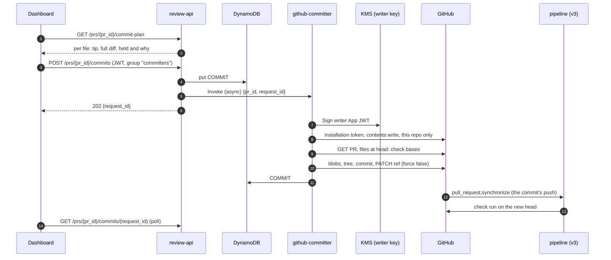

# Write-back (v4) — spec

A reviewer approves fixes in the dashboard, then asks for them to be
committed, and CascadeSec commits them to the pull request's branch as one
commit. The push that commit makes is scanned like any other, and that scan
is the fix's verification on the real branch.

Written before building, 2026-09-28. **Built 2026-09-29, not yet deployed**:
steps 1-3, 5-8 and 10 of §12 are in, and §14 records where the build departed
from this plan. Step 4 (registering the writer App) and step 9 (deploying and
verifying on the testbed) are not done, so every **(verify)** below still
stands. GitHub API claims are from GitHub's documentation and are marked
**(verify)** until a deployed run has shown them. §12 is the build order.

## 1. What v4 adds that v3's suggestions do not

v3 already puts a verified fix one click from the branch: a suggestion is
committed by the reviewer, on GitHub, under their own name. For a fix inside
the PR's diff, v4 adds very little to that. What it adds is the cases v3 has
to hold back:

- **Fixes outside the diff.** GitHub cannot take a suggestion on a line the
  PR did not show, so `report` holds the whole file ("the fix changes lines
  outside this PR's diff"). On cascadesec-testbed #2 that is most of what was
  held. A commit has no such limit.
- **Reviewer edits.** An edited fix lives only in the dashboard. Nothing
  carries it to the branch today except copying it by hand.
- **One decision, one commit.** Approvals made across several files land
  together, instead of one batch of suggestions per file.

So the unit a reviewer acts on stays the finding (approve, edit, reject, as
now). The unit that is committed is the **file**, for the same reason v3's
suggestions are per file: fixes are chained, and only a chain's last
corrected file was checked with every earlier fix applied.

## 2. The constraint v3 set: review-api does not sign

`iacposture-spec.md` §4.4 step 7 says "on approval, `review-api` calls GitHub
to push the diff". That cannot be built as written. v3 put the App key in KMS
and gave `kms:Sign` to exactly one role, belonging to a function API Gateway
cannot reach (ci-integration-spec §2.1). review-api is the dashboard's
internet-facing backend. Giving it the signing grant would undo the one
property v3's key handling was designed for.

So review-api **records the request** and hands it to a new function,
`github-committer`, which API Gateway cannot invoke. §4.4 step 7 is rewritten
to say so when this is built.

## 3. Flow



Two things are deliberately **not** the trigger:

- **Each approval.** It would commit one finding at a time, often a partial
  chain, with a push and a rescan per click. A reviewer usually approves
  several and then wants them landed together.
- **A check-run button on GitHub.** Approvals are made in the dashboard by a
  Cognito identity, and the request should carry that same identity. A
  GitHub-side button would put a second identity system in the audit log.

## 4. Credentials: a second App

Committing needs Contents **write**. Adding it to the existing App would give
it to the key that `github-gateway` signs with, and `github-gateway`'s `fetch`
parses attacker-controlled tarballs (ci-integration-spec §6.1). A bug in that
parser would then be write access to every repository the App is installed
on. Narrowing the token per call does not help, because whoever can sign the
JWT can ask for any permission the App holds.

**Proposed (W2): a second GitHub App, "CascadeSec Fixes".**

| | CascadeSec (v3, unchanged) | CascadeSec Fixes (v4) |
|---|---|---|
| Permissions | Metadata read, Contents read, Pull requests write, Checks write | Metadata read, **Contents write**, Pull requests read |
| Webhooks | `pull_request`, `check_run`, `check_suite` | none, and webhook delivery turned off |
| Key | `alias/iacposture-dev-github-app` | `alias/iacposture-dev-github-app-writer`, imported the same way |
| Signed by | `github-gateway` only | `github-committer` only |

`scripts/import_github_app_key.py` takes the alias as a parameter rather than
being copied. The writer App is installed per repository, never on "all
repositories", so installing it is the repository owner's opt-in to
write-back. The committer finds the installation with
`GET /repos/{owner}/{repo}/installation` under the writer App's JWT; a
repository without it gets "write-back not installed", not an error.

The cost is a second registration and a second install per repository. The
alternative, widening the existing App, is one line of Terraform, and it
puts write access behind the tarball parser.

## 5. What gets committed

For each file with at least one approved fix, `plan_commit` (one pure
function, §12 step 3) decides:

1. **Approved** means the finding's **latest ReviewEvent** is `approved` or
   `edited`. This is the event log, not `status`, for the reason
   `_unmet_prerequisites` gives (fix-chain-review-spec §1). Excluded: fixes
   already committed (§7), and findings marked `no_longer_detected`.
2. **The tip** is the end of the longest chain whose every link is approved
   and whose recorded `diff_sha256` still matches. This is `chain_tip`
   (github-gateway) with "approved" in place of "verified". Approved fixes
   outside that chain are named as left out, as v3 does.
3. **The base check.** The chain was drafted on one version of the file. The
   committed content is that version's corrected file in full, so it may only
   replace that exact version. `diff_applies_to` is not enough: it checks the
   diff's context lines, and a stored full file written over a version that
   changed elsewhere silently reverts the change (§8 shows this already
   happens in v3). So remediation-agent records **`base_sha256`**, the hash of
   the file the chain's root was drafted on, and every later link inherits
   it. The committer hashes the file at the PR's **current** head, read from
   GitHub rather than from the S3 snapshot, and holds the file on any
   mismatch ("the file changed since these fixes were drafted"). A fix
   without `base_sha256` was drafted before v4 and **fails closed**, as
   unverifiable `applies_after` entries already do.
4. **Content** is `fixes/<pr_id>/<tip>/<file>`, which is the reviewer's text
   if the tip was edited (reviewer-edit-spec §2.2).
5. **Unverified links.** An edited fix has `self_check_passed: false`, and a
   reviewer may approve a fix that failed its self-check. Proposed (W4):
   commit them, because a human approved them, but label each one in the
   commit plan, in the confirmation, and in the commit message. The push
   scan after the commit is the check they did not get. The follow-on
   reviewer-edit-spec §6 leans towards (re-self-checking an edit
   automatically) would clear most of these. It is not a prerequisite.

**What the reviewer sees is what is committed.** Today the dashboard shows
each finding's own diff, in the line numbers of an intermediate file. The
commit plan shows, per file, the diff from the current head to the tip, the
same diff v3 posts as suggestions. Approving from per-fix diffs and then
committing a full-file diff nobody looked at would be an unreviewed change.

## 6. Writing to GitHub

In order. Any failure holds that file or ends the request with a reason; the
committer never retries into a state it has not re-checked.

1. **Read the PR fresh**: `GET /repos/{r}/pulls/{n}`. Nothing is taken from a
   stored execution input. Refuse the request if:
   - the PR is not open;
   - `head.repo.id != base.repo.id`. That is a fork, and an installation
     token cannot push to it **(verify)**;
   - `head.ref` is the repository's default branch.
2. **Per file**: `GET /contents/{path}?ref=<head.sha>`, then check
   sha256 == `base_sha256` (§5.3). If the file at head already hashes to the
   tip's content, it is **already committed** (a retried request, or a human
   who applied the suggestions), and it is marked so without being written.
   A symlink or submodule at the path is held (§6.1 of v3: a link's target is
   what a hostile repository aims elsewhere).
3. **One commit** through the Git Data API: a blob per file, a tree on
   `base_tree = head commit's tree` keeping each path's existing mode, a
   commit with `parents: [head.sha]`, then `PATCH /git/refs/heads/<ref>` with
   `force: false`. The ref update is the compare-and-swap. If anyone pushed
   in between, the commit is not a fast-forward, GitHub answers 422, and the
   request ends as "the branch moved; ask again", with nothing written. Not
   retried automatically: a retry means re-checking every base, and a person
   asking again does that.
4. **Branch protection and rulesets** (required signatures, restricted
   pushers) answer 403 or 422 on the ref update. The request ends with
   GitHub's reason. It is never worked around.

**The commit message is code-produced only** (integrations-spec §2.3). It
carries the rule ids per file, the count of approved fixes, which of them are
unverified (§5.5), a dashboard link, and a trailer
`CascadeSec-Request: <request_id>`. It never carries model prose. The
approver's identity also stays out (W5): it is a Cognito email, the audit log
already records it, and a commit on a public repository is public forever.
The author is the writer App's bot. Whether GitHub marks API-created bot
commits as Verified **(verify)**, and whether "require signed commits" then
passes, is checked on the testbed.

## 7. After the commit

- **The record.** `COMMIT#<request_id>` becomes `committed` with the commit
  sha and a per-file outcome. Every committed fix gets
  `proposed_fix.committed = {sha, request_id, at}` and a ReviewEvent with
  action `committed` and actor `system`. Nothing lands on a branch off the
  books. Status stays `resolved`.
- **The push is scanned.** The commit's push sends `pull_request.synchronize`
  to the v3 App, like any push **(verify)**: installation-token pushes are
  not suppressed the way Actions' `GITHUB_TOKEN` pushes are. That runs scan
  and map on the new head. The fixed findings stop firing and are marked
  `no_longer_detected`, and a new check run reports the branch as it now
  is. No remediation runs, so there is no loop.
- **remediation-agent's chain root.** `_chain_root` roots a new chain at the
  last `resolved` fix on the file. Two changes:
  1. a **committed** fix is not a root. Its content is now the snapshot, and
     rooting on it again would redraft on a stale copy;
  2. an accepted fix whose `base_sha256` does not match the current snapshot
     is not a root either. The chain starts from the snapshot, and the
     accepted fix is reopened with a `system` event saying the file moved
     under it.

  Change 2 fixes a problem that predates v4. Today, approve a fix, push a
  change to the same file, and click Draft fixes: the new chain roots at the
  approved fix's content, which does not have the push in it.

## 8. A v3 bug the base check also closes

`report`'s `plan_file` checks that the chain root's diff applies to the head
snapshot, then diffs the tip's **whole** corrected file against head. Take a
`fix-proposed` fix from a Draft fixes run on commit A. The author then adds a
new resource block of their own below it (an `aws_s3_bucket`, say; commit B)
and runs Draft fixes again. The finding keeps its id, because the id hashes
`source:rule:file:line_range` and none of those changed. It is not redrafted,
because it is not `mapped`. Its diff still applies, because the context near
the top is unchanged. The tip's file was written before the bucket existed,
so the suggestion **deletes the bucket**, on lines the PR added, which are
visible. It posts, labelled "verified together" with the KMS rule.

The fix is the tip whenever it forms the longest verified chain on the file.
That happens if the new block's own fixes are all held, as S3 bucket fixes
were on PugetScope #10, or if there is only one of them: a tie on chain
length goes to the larger `finding_id`, which is effectively arbitrary.

**Reproduced 2026-09-28** at the `plan_file` level, with the real
`diff_lines`, `diff_applies_to` and `plan_file` on a KMS key (commit A) plus
an appended bucket (commit B). The result was two suggestions: the rotation
line, and an empty suggestion over lines 5–8, which is the bucket.

**Reproduced live the same day** on
[cascadesec-testbed #3](https://github.com/konradkelly/cascadesec-testbed/pull/3).
Commit A (`17a808d`) added a KMS key without rotation, and Draft fixes posted
`CKV_AWS_7`'s rotation fix. Commit B (`42307a6`) appended an `aws_kms_alias`
for the key and a bastion security group with SSH open. The KMS finding kept
its id and its `fix-proposed` status, and the bastion's findings were mapped,
so the check offered Draft fixes. The bastion's SSH fix was held for a
person, which left the KMS fix as the file's longest verified chain. Draft
fixes on B posted "part 2 of 2": an empty suggestion on lines 6–10, deleting
the alias, labelled "verified together: `CKV_AWS_7`". The check summary said
the file's suggestions "were self-checked together as one change". Both Draft
fixes runs were started directly, with the input and execution names the
button produces, rather than by clicking.

The same run shows a smaller issue: the rotation suggestion is now posted
twice, once per run. The duplicate check matches only the current execution's
marker.

**Fixed and verified live, 2026-09-28.** remediation-agent records
`base_sha256`, and `plan_file` posts a chain's file only over a head with
that hash. On the same PR, commit C (`190785b`) moved the key down a line.
Its fix recorded the hash of C's file, which matched a local hash of the
checkout, and the rotation suggestion posted alone. Commit D (`21ea7a5`)
appended a second alias and opened RDP on the bastion. With the same
preconditions as B, the check reported `reports.tf` as "the file has changed
since this fix was drafted" and posted nothing.

Three more things this turned up:

- **The scanner failed every scan after a finding stopped firing.**
  `_write_findings` re-marked findings already `no_longer_detected` under a
  condition whose failure it did not catch. Commit C's Draft fixes run was
  the first scan on any PR after a mark. Fixed in the same change: marked
  findings are skipped, and losing a race for the mark is caught.
- **A failed Draft fixes run cannot be retried on the same commit.** The
  button's execution name is (PR, commit, `fixes`), and Step Functions
  refuses a used name for 90 days, failed or not. So a second click after a
  failure starts nothing, and nothing says so. Not fixed.
- **"Run Draft fixes again" is wrong advice for a held stale fix.** Draft
  fixes drafts only `mapped` findings. A stale fix is still `fix-proposed`,
  so it is never redrafted. §7's second `_chain_root` change covers this:
  a fix whose base no longer matches the snapshot goes back to `mapped`.
  **Fixed with v4 step 1:** remediation-agent reopens a `fix-proposed` or
  `resolved` fix whose base is not the snapshot (or who has none), with a
  `system` event, along with whatever it superseded, and redrafts them in
  the same run. The gateway's `select_files` picks a changed file for that
  even with nothing mapped on it, and a push's check offers Draft fixes
  for it. Both sides share one predicate, `_stale_reason`, which
  `corpus/test_corpus.py` keeps identical. A continuation invocation does
  not reopen: the chain it resumes was drafted on the snapshot the run
  read.

## 9. Authorisation

A Cognito identity is not a GitHub identity. Today any dashboard user can
approve anything, which is harmless while an approval changes only a
DynamoDB row. Once an approval leads to a commit, it is a write to someone's
repository. v4 adds a Cognito group, `committers`. `POST /commits` returns
403 unless the verified JWT's `cognito:groups` contains it (W6). Approving
stays open to every reviewer. Only the commit is gated.

This is single-tenant authorisation, and the spec says so: a committer can
commit to any repository the writer App is installed on. Per-repository
scoping is machine-auth-spec's project model. The writer App's per-repository
install (§4) is the real boundary in the meantime.

## 10. Data model

```
CommitRequest (new, same table)
├── pk: PR#<pr_id>
├── sk: COMMIT#<request_id>          # ULID: sorts by time
├── requested_by                     # verified JWT, never the body
├── requested_at, updated_at
├── status: requested | committing | committed | held | failed
├── commit_sha, head_sha_before
└── files: [{ file, tip, chain, outcome: committed | held | already | left-out, reason }]

PullRequestMeta (new; written by the state machine after Fetch, §12 step 2)
├── pk: PR#<pr_id>
├── sk: GITHUB
└── repository (owner/name), repository_id, pr_number

proposed_fix gains:  base_sha256, committed: { sha, request_id, at }
ReviewEvent.action:  gains "committed" (actor "system")
```

Every existing reader queries `begins_with(sk, "FINDING#")`, so neither new
item appears in a finding list. `PullRequestMeta` is needed because nothing
stored today maps a `pr_id` back to a repository name and PR number, and
review-api has to answer "is this a GitHub PR, and which one" without
calling GitHub.

**Idempotency.** review-api writes `COMMIT#` with `attribute_not_exists`,
and refuses a second request on a PR while one is `requested` or
`committing` (409). Lambda retries an async invoke up to twice. The committer
moves `requested` to `committing` conditionally. On a retry that finds
`committing`, it looks for its own trailer on the branch's head commit
before doing anything, and treats already-committed files as in §6 step 2.
An on-failure destination records the request as `failed`, so the dashboard
never polls forever.

## 11. Decisions

| # | Decision | Outcome |
|---|---|---|
| W1 | review-api never signs. A separate `github-committer` does, and API Gateway cannot reach it (§2) | Follows from v3 D7; proposed |
| W2 | Second App for Contents write, rather than widening the existing one (§4) | **Open.** Proposed: second App. Built that way 2026-09-29 |
| W3 | Trigger: one explicit request per PR, not each approval, not a GitHub button (§3) | Proposed |
| W4 | Approved but unverified fixes (edits, failed checks): commit them labelled, or refuse (§5.5) | **Open.** Proposed: commit, labelled. Built that way 2026-09-29 |
| W5 | Approver identity kept out of the commit message (§6) | Proposed |
| W6 | Commit gated on the Cognito group `committers` (§9) | Proposed |
| W7 | Fork PRs: refused, with "apply the suggestions instead" | Proposed |
| W8 | A moved branch ends the request, with no automatic retry (§6.3) | Proposed |
| W9 | Ownership | Konrad |

## 12. Build order

Each step is a commit of its own, and none needs the next to be useful.

1. **`base_sha256`, and the v3 bug.** §8 is reproduced (testbed #3); its
   scenario becomes a regression test first. remediation-agent records `base_sha256` on every fix, inherited along the
   chain. `report`'s `plan_file` holds a file whose head no longer matches.
   `_chain_root` makes both changes in §7. Deployable alone; it fixes v3.
2. **`PullRequestMeta`**, written by the state machine itself: a
   `dynamodb:putItem` service-integration state after Fetch, built from the
   execution's `github` input. Not from `fetch`: github-gateway's role has
   only `dynamodb:Query` today, and a table-wide write grant on the function
   that parses tarballs is the exposure §4 exists to avoid. The state
   machine's role gains `PutItem`, conditioned on
   `dynamodb:LeadingKeys` = `PR#gh-*`.
3. **`plan_commit`**: pure, with tests. Input is the PR's findings, their
   latest events, and a function from S3 key to content. Output is the
   per-file plan of §5. It lives in `github-committer`. review-api needs
   the same answer for the preview, so it gets a copy under the same
   agreement test `corpus/test_corpus.py` already uses for
   `SNAPSHOT_SUFFIXES`. The preview uses the S3 snapshot as the head. The
   committer re-checks against GitHub, and the preview says it is a
   preview.
4. **The writer App**: registered by hand (as v3 step 1 was), key imported
   with `import_github_app_key.py --alias …-writer`, and installed on
   cascadesec-testbed only.
5. **Terraform**: `lambda_github_committer.tf` with its role (`kms:Sign` on
   the writer key, table read, `UpdateItem`/`PutItem`, `s3:GetObject` on
   `fixes/*`, no `scans/*` write), an on-failure destination, and
   `lambda:InvokeFunction` on it for review-api's role. Also the Cognito
   group.
6. **review-api**: `GET /prs/{pr_id}/commit-plan`,
   `POST /prs/{pr_id}/commits`, and `GET /prs/{pr_id}/commits/{request_id}`,
   all three behind the existing JWT authorizer, with the group check on
   the POST.
7. **`github-committer`**: §6 and §7, with tests against a fake GitHub
   following github-gateway's test pattern.
8. **Dashboard**: a commit panel on the PR page, for `gh-` PRs only. It
   shows the plan per file (the full diff, held files and why, unverified
   links), then a Commit button, then the request's status with a link to
   the commit.
9. **Deploy and verify on cascadesec-testbed**, one scenario each: a fix in
   the diff; testbed #2's out-of-diff held file; an edited fix; a push
   between approving and committing (held on base); a push during the
   commit (non-fast-forward); a fork PR (refused); a non-committer (403).
   Also the post-commit push scan marking the findings
   `no_longer_detected`. Metrics: `CommitsCreated`, `FilesCommitted`,
   `FilesHeldFromCommit`.
10. **Docs**: rewrite `iacposture-spec.md` §4.4 step 7, add §4.1 rows for
    `github-committer` and the writer key, update §5's data model and the
    §8 v4 row, add a pointer from ci-integration-spec §7, and update the
    README roadmap.

## 13. Not in v4

- **Forks** (W7). The suggestions remain the path for them.
- **Committing on approval**, with no request (W3).
- **Merging**, or committing to a default branch.
- **Fixes to files the PR did not change.** `select_files` only drafts for
  changed files (ci-integration-spec §4.3), so there is nothing approved
  there to commit. Widening Draft fixes is a separate decision about cost.
- **GitLab, and the other CI platforms.** Write-back there would go through
  integrations-spec's surfaces, not this function.

## 14. As built (2026-09-29)

Where the build departed from, or added to, the plan above.

- **What was confirmed is what is committed.** §5 says the reviewer sees
  what is committed; the build enforces it. `plan_commit` returns each
  file's `content_sha256`, the POST carries `confirm: [{file, tip,
  content_sha256}]` from the plan the reviewer was shown, and review-api
  refuses with 409 if its own preview no longer offers exactly that. An
  edit keeps its finding id and changes its content, so the tip alone was
  not enough. The confirmed set is stored on the request, and the committer
  holds any file whose tip or hash differs ("not what was confirmed").
- **Step 1's reopen.** remediation-agent reopens a `fix-proposed` or
  `resolved` fix whose base is not the snapshot, or who has none, and
  whatever it superseded, conditional on the status it read, with a
  `system` event. It does so per file before choosing the chain root, not
  inside `_chain_root`, so the reopened findings are drafted in the same
  run. A continuation invocation does not reopen. The gateway selects, and
  offers Draft fixes for, a changed file whose only work is a stale fix. A
  held fix (`needs-human-only`, which a rejection also sets) is left alone.
- **Twin deliveries.** Lambda can deliver one async event twice at once.
  The loser of the ref race then gets a non-fast-forward 422, and ending the
  request "held" would overwrite the winner's commit. So on a failed ref
  update the committer re-reads the branch, and steps aside if the head
  carries its own trailer. Every ending is conditional on `committing`.
- **The failure backstop** is an on-failure destination to the default
  EventBridge bus and a rule back to the committer, the pipeline's backstop
  shape. It never raises, and it ignores a failure record whose payload is
  itself one, so it cannot loop.
- **The head is walked one directory at a time** through the Git Data API,
  not with the recursive tree listing, which GitHub truncates on a large
  repository. A path with `.`, `..` or an empty component is refused.
- **"Already" files are recorded as committed**, with the head's sha: the
  fix is on the branch, and `_chain_root` must not root on it again.
- **Write-back deploys only once `var.github_writer_app_id` is set.** Until
  then no committer exists, review-api answers a commit request with 503,
  and the dashboard says write-back is not deployed. The Cognito group is
  created either way.
- **The group claim.** An HTTP API's JWT authorizer passes `cognito:groups`
  as the string `"[a b]"`, not a list; review-api reads both.
- **Metrics** are `CommitsRequested` (review-api), `CommitsCreated`,
  `FilesCommitted`, `FilesHeldFromCommit` and `CommitsFailed` (the
  committer), in the `IaCPosture` namespace.

- **A finding that moved lines keeps its id** (found on the first live
  commit, 2026-09-30). A finding's id hashes its line range, so the scan of
  the commit's push -- one added line in `ledger.tf` -- marked 16 findings
  below it no longer detected and recreated each at `raw` under a new id,
  stranding held fixes and audit trails. The same happened whenever an
  author's push inserted lines, but write-back makes it routine. The
  scanner now pairs, within one scan, an unmarked finding that stopped
  firing with a new one of the same source, rule, file and resource, in
  line order, and writes the new one under the old id. A finding with no
  resource is not paired. Ids themselves are unchanged, so no migration.
  **Verified live, 2026-09-30:** on the same PR, commit `7cfcacf` inserted
  one comment line at the top of `ledger.tf`. The scan logged all 16 of the
  file's live findings as moved; every one kept its id, status and fix with
  its lines one further down, no finding was created or newly marked gone,
  and the PR stayed at 66. The 16 stranded by the first commit were repaired
  by hand beforehand, by the same pairing rule.

Still to do: register "CascadeSec Fixes" (Metadata read, Contents write,
Pull requests read; webhooks off), import its key with
`scripts/import_github_app_key.py --alias alias/iacposture-dev-github-app-writer`,
install it on cascadesec-testbed only, apply with `-var
github_writer_app_id=<id>`, add a user to `committers`, and run §12 step 9.
